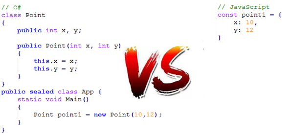

# From Native Web to Angular
### Web development in the age of Frameworks

(This document is optimized for presentation using [reveal-md](https://github.com/webpro/reveal-md))

---

# Web Development

### What &amp; Why
* Why (Modern) Web?
* The Basics: HTML, CSS JavaScript
* The Age of Frontend Frameworks
* Debugging
* Testing

---

### Who am I?

Yuval Bar Levi (33)   7 Years of Web Development  
Play with open source (Webiks, Midburn etc.) and Teaching (Web, Python)  

    

    

    Geo Data Visualization  
    Large scale web app  
    Top of the edge web tech  

---

### Why (Modern) Web?
* Low cost Maintenance
<!-- .element: class="fragment" -->
* Easy debugging, testing and deployment
<!-- .element: class="fragment" -->
* Great high quality, secure and FREE open-source tools and frameworks (with open-source license)
<!-- .element: class="fragment" -->
* Fast and reliable development (Agile, open source community, Docs, CI/CD, Browser view source , constant updates)
<!-- .element: class="fragment" -->
* Separation of concerns - high modularity (front to back AND inner modularity) - I care not about your server as long as it serves...
<!-- .element: class="fragment" -->

---

### The Basics: HTML, CSS

* HTML - a specific version of SGML (like - XML)
<!-- .element: class="fragment" -->
* HTML determine what, css say how (making style changes and themes easy)
<!-- .element: class="fragment" -->

    

<!-- .element: class="fragment" -->
<a href="Calculator.html" target="_blank">Basic HTML</a>
<!-- .element: class="fragment" -->
* 
The Power of CSS [-1-](https://a.singlediv.com) [-2-](https://cssanimation.rocks/space-transitions/)

<!-- .element: class="fragment" -->

---

### The Basics: JavaScript

* JavaScript is simple, 
<!-- .element: class="fragment" -->
yet powerful (<a href="/Calculator.html" target="_blank">calculator.html</a>, [online editor](https://codepen.io/Venerons/pen/BvHbK))

    

---

### The Age of Frontend Frameworks
Why using a framework?
- Reusable Components
<!-- .element: class="fragment" -->
- Structured, Upgradable and Maintainable
<!-- .element: class="fragment" -->
- Built-in Features: 2 Way binding, Routing, Encapsulation
<!-- .element: class="fragment" -->
- It's not mandatory
<!-- .element: class="fragment" -->

---

### The Age of Frontend Frameworks
Why Angular?
- Designed for Large Scale
<!-- .element: class="fragment" -->
- Google and Open Source Community support
<!-- .element: class="fragment" -->
- Rapid Upgrades
<!-- .element: class="fragment" -->
- TypeScript (With Vanilla JS support)
<!-- .element: class="fragment" -->
- Built-in High quality Developing, Testing and Code-Building tools
<!-- .element: class="fragment" -->

__Angular 5 Robot Factory Demo__
<!-- .element: class="fragment" -->

---

### Debugging
* Dev-tools - all in one Wonder (Elements, console, network, performance and more...)
<!-- .element: class="fragment" -->
* Production debugging
<!-- .element: class="fragment" -->
* Logging
<!-- .element: class="fragment" -->

---

### Testing 
* Karma <!-- .element: class="fragment" -->and [Jasmine](https://jasmine.github.io/pages/docs_home.html) - Angular built-in testing tools

* TDD
<!-- .element: class="fragment" -->
* Advanced scenarios (DOM, HTTP mock & RX) and E2E
<!-- .element: class="fragment" -->

---

# Questions? 

---

## Thank you :)