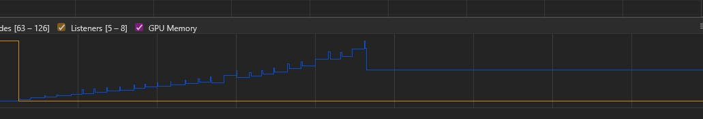

# Memory leaks

(This document is optimized for presentation using [reveal-md](https://github.com/webpro/reveal-md))

---

## Overview
<div style="float:left">
    
</div>
<!-- .element: class="fragment" -->
Memory leaks are like Pokemons<br/>
Lets catch them all!
<!-- .element: class="fragment" -->

<br/>
<br/>

## Goals
<!-- .element: class="fragment" -->
* Understand/Define what is a memory leak
<!-- .element: class="fragment" -->
* Go trough optional causes
<!-- .element: class="fragment" -->
* Analyse with dev-tools
<!-- .element: class="fragment" -->

---

## What & Why
<!-- .element: class="fragment" -->
* A (very) loose definition:
 memory leak occurs when a memory which is no longer needed is not released.

<!-- .element: class="fragment" -->
* Why does it happen? Code is holding object references which are not required anymore.
<!-- .element: class="fragment" -->
* Like What? Unnecessary objects, detached DOM nodes or - leftovers from past components (Like observables)
<!-- .element: class="fragment" -->
* Note 1: avoid using delete. setting to null is enough.
<!-- .element: class="fragment" -->
* Note 2: Another issue may be a memory "bloat": Memory bloat is when a page uses more memory than is necessary for optimal page speed (which is per-device...)
<!-- .element: class="fragment" -->


---

## Example 1
```
    // some bad ideas
    Window['largeObject'] = new largeObject();
    Window['largeLibrary'] = require(./someVanillaJSLibrary);
```

---

## Example 2
```
    function work() {
        const worker = new worker();
        worker.doSomeWork();
        return worker; //do we really need this?
    };

    const dumbWorker = work();
```

---

## Example 3
```
    // Closures
    function someObject() {
        const extraLarge = new largeObject();
        return function() {
            console.log('I can use extraLarge object')
        };
    };
```

---

## Example 4
```
    // Observables

```

---

## Demo 1: Cats (ex01.html)
* Code overview
* Use memory tab and profiling tool
* Click around

<div>
    
</div>

---

# Conclusion and Tips
<!-- .element: class="fragment" -->
* Avoid global scope and the <!-- .element: class="fragment" --> _delete_ keyword

* Release object reference when done
<!-- .element: class="fragment" -->
* Unsubscribe from Observables safely when done using them (for angular OnDestroy hook should be useful)
<!-- .element: class="fragment" -->